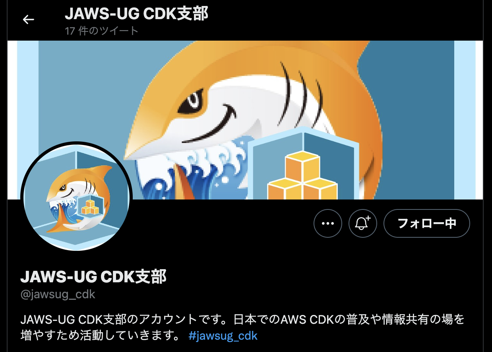
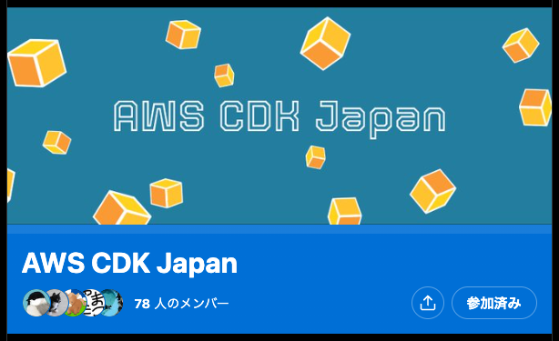
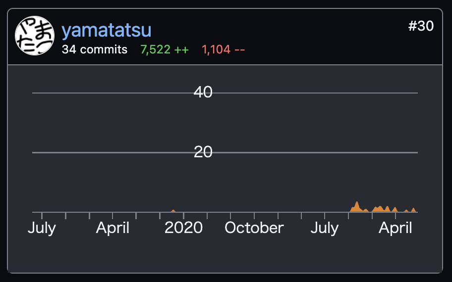
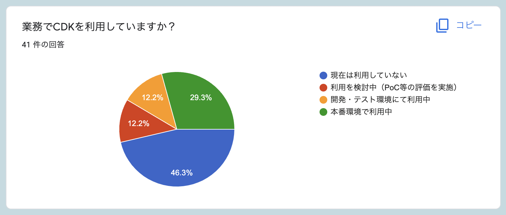

サンプルとこのスライドのコード

https://github.com/yamatatsu/slide-devio-2022
---
<dev style="display: flex; justify-content: center; align-items: center; margin-top: 40px;">
  
  <ul style="list-style-type: none; line-height: 1.4">
    <li style="font-size: 36px; font-weight: 700;">山本達也（やまたつ）</li>
    <li style="font-size: 30px; margin-bottom: 24px;">@Classmethod</li>
    <li style="font-size: 20px; margin-bottom: 8px;">
      <a href="https://twitter.com/yamatatsu193">Twitter: @yamatatsu193</a>
    </li>
    <li style="font-size: 20px; margin-bottom: 8px;">
      <a href="https://github.com/yamatatsu">GitHub: @yamatatsu</a>
    </li>
    <li style="font-size: 20px; margin-bottom: 8px;">
      コミュニティ活動:
      <ul style="list-style-type: disc">
        <li>JAWS-UG CDK支部</li>
      </ul>
    </li>
    <li style="font-size: 20px; margin-bottom: 8px;">
      OSSコントリビューション:
      <ul style="list-style-type: disc">
        <li>aws-cdk</li>
      </ul>
    </li>
  </ul>
</dev>
---
 <!-- .element height="500" -->
Notes:
JAWS-UG CDK支部やってます！  
https://twitter.com/jawsug_cdk  
次回は9月の頭ころかな？
---
 <!-- .element height="500" -->
Notes:
CDKのTwitterコミュニティもあります！  
https://twitter.com/i/communities/1539905872230420481 <!-- .element: style="overflow-wrap: break-word;" -->

CDKに関する質問や共有などなんでも！
---
 <!-- .element height="500" -->

https://github.com/aws/aws-cdk/graphs/contributors
---
改めてタイトル
---
# AWS CDK で
# AWS App Runner
---
- **AWS App Runnerとは？**
  - フルマネージドコンテナサービス <!-- .element style="font-size: 32px; line-height: 60px" -->
  - 簡単な設定でコンテナ化したWebサーバーをAWS環境にローンチできる <!-- .element style="font-size: 32px; line-height: 60px" -->
- **AWS CDKとは？**
  - Infrastructure as Code (IaC) <!-- .element style="font-size: 32px; line-height: 60px" -->
  - アプリケーションのプログラミング言語を用いてクラウドインフラストラクチャを定義できる <!-- .element style="font-size: 32px; line-height: 60px" -->
---
 <!-- .element style="width: 80vw" -->
---
### この登壇の狙い

- CDK ビギナー向けの話にしよう
- 擬似的に CDK を体験できるセッションにしよう
Notes:
ライブコーディングができたら一番かっこいいのですが、タイピング能力が赤ちゃんなのでスライドでなんとかします！
---
 <!-- .element height="600" style="margin-top: 0" -->
Notes: こんな構成で作成しようと思います。
