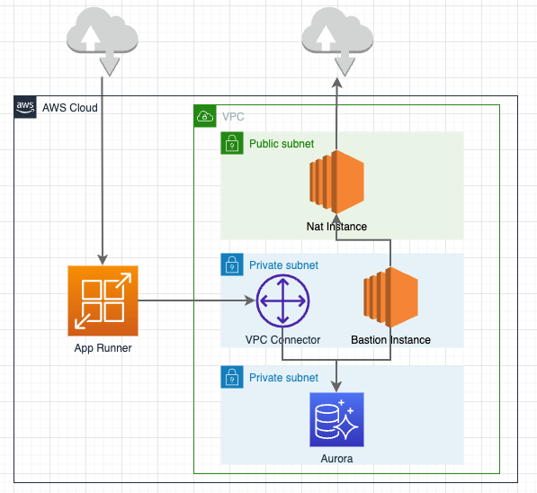
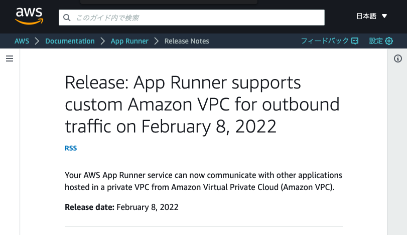
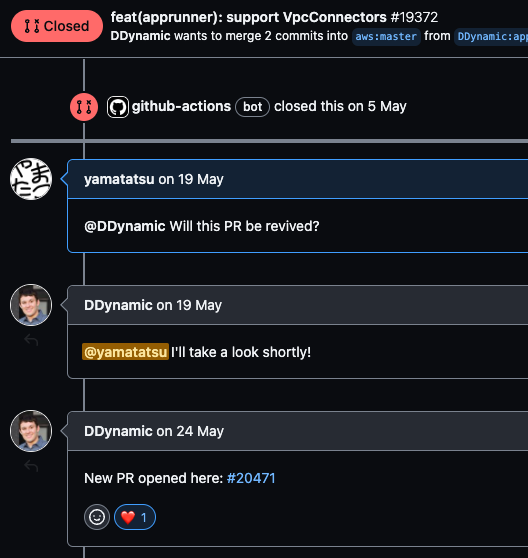

### 目次

- ~~CDK で App Runner してみる~~
- **RDS に繋いでみる**
- カスタムドメインを設定してみる
- Tipsなど
---
## RDS に繋いでみる
---
 <!-- .element height="600" style="margin-top: 0" -->
Notes: もう一度、構成図を見てみましょう。

この図の右側の盛りだくさんのとこについて、説明していきます。
---
 <!-- .element height="500" -->
Note: 今年の2月に、App RunnerはVPCと繋ぐことができるようになりました
---
 <!-- .element height="600" -->
Note: CDKでも5月に、PRがマージされてL2として使うことができるようになりました。
---
さっそくstackの中身を修正していきます！
---
```ts [|3-5|13-25|44-47|70|27-42|48|65-67|55-58,71|74-78|]
import { Construct } from "constructs";
import * as cdk from "aws-cdk-lib";
import * as ec2 from "aws-cdk-lib/aws-ec2";
import * as rds from "aws-cdk-lib/aws-rds";
import * as iam from "aws-cdk-lib/aws-iam";
import * as assets from "aws-cdk-lib/aws-ecr-assets";
import * as apprunner from "@aws-cdk/aws-apprunner-alpha";

export class PlaygroundCdkStack extends Stack {
  constructor(scope: Construct, id: string, props?: StackProps) {
    super(scope, id, props);

    const vpc = new ec2.Vpc(this, "Vpc", {
      natGatewayProvider: ec2.NatProvider.instance({
        instanceType: ec2.InstanceType.of(
          ec2.InstanceClass.T3,
          ec2.InstanceSize.NANO
        ),
      }),
      subnetConfiguration: [
        { name: "db-subnet", subnetType: ec2.SubnetType.PRIVATE_ISOLATED, cidrMask: 28 },
        { name: "app-subnet", subnetType: ec2.SubnetType.PRIVATE_WITH_NAT, cidrMask: 24 },
        { name: "public-subnet", subnetType: ec2.SubnetType.PUBLIC, cidrMask: 24 },
      ],
    });

    const database = new rds.DatabaseCluster(this, "Database", {
      engine: rds.DatabaseClusterEngine.auroraMysql({
        version: rds.AuroraMysqlEngineVersion.VER_2_10_2,
      }),
      instanceProps: {
        instanceType: ec2.InstanceType.of(
          ec2.InstanceClass.T3,
          ec2.InstanceSize.SMALL
        ),
        vpc,
        vpcSubnets: { subnetGroupName: "db-subnet" },
      },
      defaultDatabaseName: "mydb",
      credentials: rds.Credentials.fromGeneratedSecret("admin"),
      removalPolicy: cdk.RemovalPolicy.DESTROY,
    });

    const vpcConnector = new apprunner.VpcConnector(this, "VpcConnector", {
      vpc,
      vpcSubnets: { subnetGroupName: "app-subnet" },
    });
    database.connections.allowDefaultPortFrom(vpcConnector);

    const asset = new assets.DockerImageAsset(this, "ImageAssets", {
      directory: "./app",
      platform: assets.Platform.LINUX_AMD64,
    });

    const instanceRole = new iam.Role(this, "InstanceRole", {
      assumedBy: new iam.ServicePrincipal("tasks.apprunner.amazonaws.com"),
    });
    database.secret!.grantRead(instanceRole);

    new apprunner.Service(this, "Service", {
      source: apprunner.Source.fromAsset({
        asset: asset,
        imageConfiguration: {
          port: 3000,
          environment: {
            DB_SECRET_NAME: database.secret!.secretName,
          },
        },
      }),
      vpcConnector,
      instanceRole: instanceRole,
    });

    const bastion = new ec2.BastionHostLinux(this, "Bastion", {
      vpc,
      subnetSelection: vpc.selectSubnets({ subnetGroupName: "app-subnet" }),
    });
    database.connections.allowDefaultPortFrom(bastion);
  }
}
```
Note:
先程のファイルをこのように修正します。

まずは必要なモジュールをimportして、

VPCを作成して、

apprunner.VpcConnector を作成して、

apprunner.Service に渡してあげれば、これでVPCとApp Runnerを繋ぐことができます。

次に、 DatabaseCluster を作成して、

App RunnerからAuroraへ接続するための設定をしていきます。

最後に、DBを設定するための踏み台サーバーを用意します。
---
```ts [|23-25|25-34|14-18]
import fastify from "fastify";
import { Pool } from "mariadb";
import {
  SecretsManagerClient,
  GetSecretValueCommand,
} from "@aws-sdk/client-secrets-manager";

const app = fastify({ logger: true });

app.get("/", (req, res) => {
  res.send("OK");
});

app.get("/items", async (req, res) => {
  const conn = await app.mariadb.getConnection();
  const items = await conn.query("SELECT * FROM items;");
  res.send({ items });
});

const secretsManagerClient = new SecretsManagerClient({
  region: "ap-northeast-1",
});
secretsManagerClient
  .send(new GetSecretValueCommand({ SecretId: process.env.DB_SECRET_NAME }))
  .then(({ SecretString: secretString = "" }) => {
    const secrets = JSON.parse(secretString);
    app.register(require("fastify-mariadb"), {
      host: secrets.host,
      port: secrets.port,
      database: secrets.dbname,
      user: secrets.username,
      password: secrets.password,
      promise: true,
    });

    app.listen({ port: 3000, host: "0.0.0.0" });
  })
  .catch((err) => {
    console.error(err);
  });

declare module "fastify" {
  interface FastifyInstance {
    mariadb: Pool;
  }
}
```
Note:
アプリケーションコードはこのように修正します。

繰り返しになりますが、コンテナの中なので好きな言語、好きなフレームワークで実装していただければと思います。
---
```bash
# terminal にて

> npx cdk deploy
```
Note:
デプロイしてみましょう
---
```bash
# terminal にて

> curl https://xxxxxxxxxx.ap-northeast-1.awsapprunner.com/items
# {"items":[{"id":1,"name":"sample"}]}
```
Note:
デプロイが完了したら /items を呼び出してみます。
---
### App RunnerからRDSに接続できました！ 🎉 <!-- .element style="text-transform: none" -->
