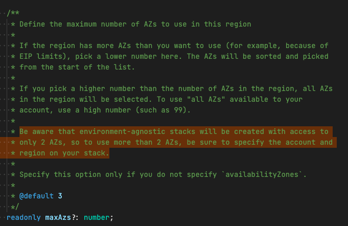
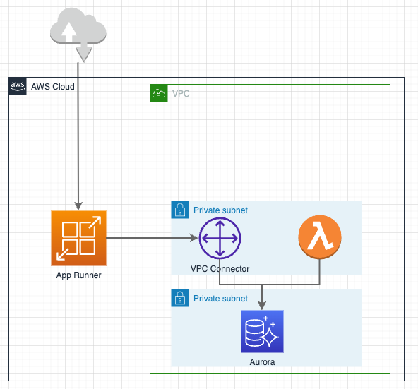
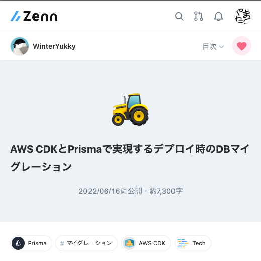

### 目次

- ~~CDK で App Runner してみる~~
- ~~RDS に繋いでみる~~
- ~~カスタムドメインを設定してみる~~
- **Tipsなど**
---

### Tipsとか小ネタ

- ec2.VPC について
- もっとかっこよくdb migrationしたい
- 環境ごとの値の管理
---
### ec2.VPC について
---
<pre data-id="code-animation"><code data-line-numbers="" class="hljs" data-trim>
new ec2.Vpc(this, "Vpc", {
});
</code></pre>
Notes:
これだとNatGatewayが作成されます。
---
<pre data-id="code-animation"><code data-line-numbers="" class="hljs" data-trim>
new ec2.Vpc(this, "Vpc", {
  natGatewayProvider: ec2.NatProvider.instance({
    instanceType: ec2.InstanceType.of(
      ec2.InstanceClass.T3,
      ec2.InstanceSize.NANO
    ),
  }),
});
</code></pre>
Notes:
natGatewayProvider を設定することでnat instanceを作成するように変更できます。
---
<pre data-id="code-animation"><code data-line-numbers="" class="hljs" data-trim>
new ec2.Vpc(this, "Vpc", {
  natGateways: 0,
});
</code></pre>
Notes:
natGateways: 0 を設定することでnat gateway, nat instanceのどちらも建てない設定もできます。

この場合は、subnetTypeとしてPRIVATE_WITH_NATは使えなくなることに注意してください。
---
<pre data-id="code-animation"><code data-line-numbers="" class="hljs" data-trim>
new ec2.Vpc(this, "Vpc", {
});
</code></pre>
Notes:
ところで、このec2.Vpc、注意しないとAZを2つまでしか使ってくれません。
---
<pre data-id="code-animation"><code data-line-numbers="" class="hljs" data-trim>
new ec2.Vpc(this, "Vpc", {
  maxAzs: 3,
});
</code></pre>
Notes:
このようにmaxAzs: 3を指定しても、2つまでしかAZを使ってくれない場合があります。
---
# 🤔
---

Note:ドキュメントを読むと答えが書いてあります

---
`environment-agnostic` ??
---
```ts []
// environment agnostic
new MyStack(app, 'MyStack', {})

// environment specified
new MyStack(app, 'MyStack', {
  env: {
    account: '123456789012',
    region: 'ap-northeast-1',
  },
})
```
Notes:
propsにてenvを指定していないstackのこと。

デプロイについて柔軟であるが、デプロイ先間違える事故につがなることも。

加えて、リージョンのAZをフル活用してくれない問題がある。

余談だが、[App RunnerのドキュメントにもAZを3つ以上つくことが望ましい旨が記載されている](https://docs.aws.amazon.com/apprunner/latest/dg/network-vpc.html#:~:text=we%20recommend%20that%20you%20select%20subnets%20across%20at%20least%20three%20Availability%20Zones.)。
---
公式のEnvironment Agnosticに関する説明: https://docs.aws.amazon.com/cdk/v2/guide/environments.html <!-- .element: style="overflow-wrap: break-word;" -->
---
### もっとかっこよくdb migrationしたい
---
 <!-- .element height="600" style="margin-top: 0" -->
Notes:
今回のサンプルでは、説明は端折りましたが、裏では上記のようなSQLを踏み台から実行していました。

1. セッションマネージャを用いて踏み台にアクセスし
1. mysql clientをyumでインストールし
1. AWS Secrets ManagerからDB接続情報を取り出し
1. DBにアクセスして
1. SQLを実行していました。
---
```sql []
CREATE TABLE items (
  id INT(6) UNSIGNED AUTO_INCREMENT PRIMARY KEY,
  name VARCHAR(30) NOT NULL
);
```
Notes:
こんなSQL。あとINSERT文も。
---
それLambdaでやればよいのでは？
---
 <!-- .element height="600" style="margin-top: 0" -->
---
 <!-- .element height="600" style="margin-top: 0" -->
---
そのLambda，Custom Resourceにしてしまえばよいのでは？
---
 <!-- .element: height="600px" -->
Notes:
https://zenn.dev/winteryukky/articles/d766b9ab98eb23 <!-- .element: style="overflow-wrap: break-word;" -->
---
### 環境ごとの値の管理
---
cdk.jsonのcontextを使うサンプルが多い
---
でもTypeScriptでやるなら .ts でよいと思う

（TS以外の言語は別バナ）
---
環境ごとの値を .ts で管理するメリット
- 余計なanyをコードに持ち込まずに済む
- key名を間違えたり未定義だったりすると型エラーで検出できる
- 文字列結合した値とかも用意できる
Notes:
TypeScript（javaScript）はJSONを雑に扱うのがうまいので、わざわざ型定義のできないcdk.jsonに書く意味はないはず。
---
```ts [|1-6|8-12|15-29|31-32]
const ENV_NAMES = ["dev", "stg", "prd"] as const;
type EnvName = typeof ENV_NAMES[number];
export const envName = (process.env.ENV_NAME as EnvName) || "dev";
if (!ENV_NAMES.includes(envName)) {
  throw Error(`Bad ENV_NAME '${envName}'`);
}

// 型を用意
type EnvValues = {
  wafArn: string;
  domainName: string;
};

// anyではなくstringとして環境ごとの値を定義できる。
const envValueMap: Record<EnvName, EnvValues> = {
  dev: {
    wafArn: "<dev環境のWAFのARN>",
    domainName: "dev.yamatatsu.dev",
  },
  stg: {
    wafArn: "<stg環境のWAFのARN>",
    domainName: "stg.yamatatsu.dev",
  },
  prd: {
    wafArn: "<prd環境のWAFのARN>",
    domainName: "yamatatsu.dev",
  },
};
export const env = envValueMap[envName];

// 文字列結合した値とかも用意できる
export const stackPrefix = `${envName}PlayAppRunner`;
```
---
でも秘匿情報はParameter Storeとかに入れよう！
---
```ts []
ssm.StringParameter.fromStringParameterAttributes(
  this, 
  'MyValue', 
  { parameterName: '/My/Public/Parameter' },
);

ssm.StringParameter.fromSecureStringParameterAttributes(
  this, 
  'MySecureValue', 
  { parameterName: '/My/Secret/Parameter' version: 5 },
);
```
---
以上、Tipsでした！
