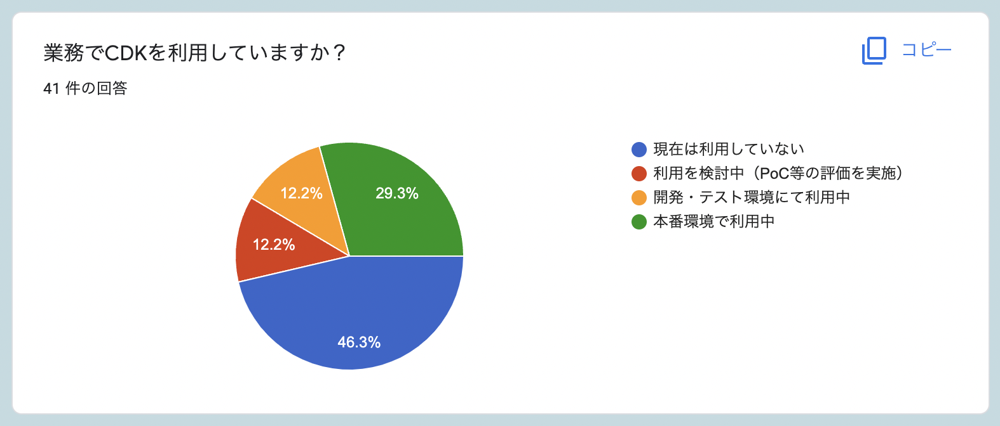
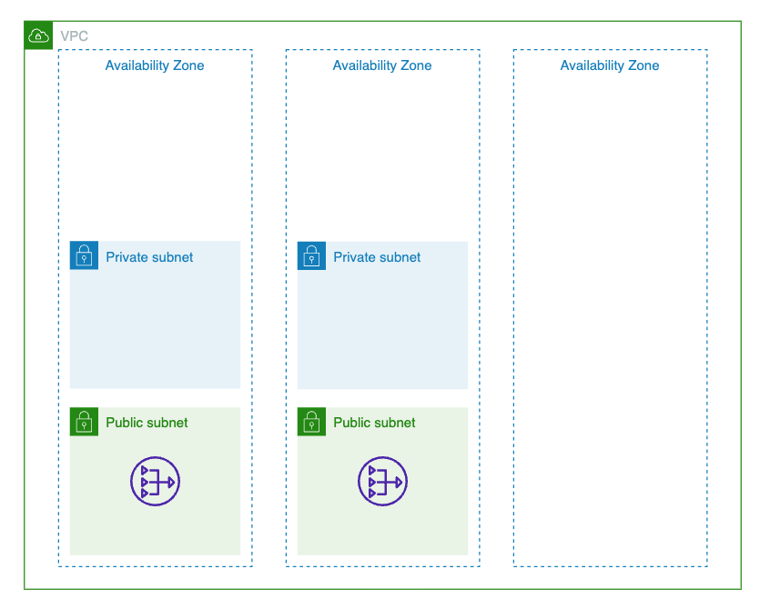
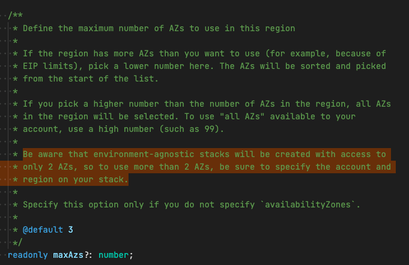
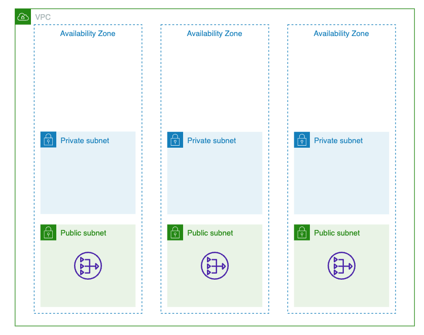
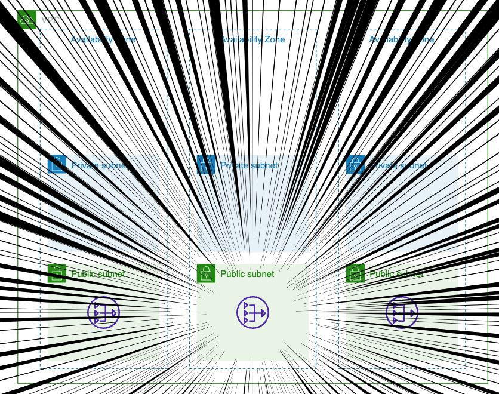

import { Notes, Head, Steps } from "mdx-deck";
import { CodeSurferLayout, vsDarkPartial } from "code-surfer";
import { Meta, Profile, AlignLeft, Header, TitleBackground, NormalBackground } from "./parts";
import "main.css";

export const theme = vsDarkPartial;

<Head>
  <Meta
    title="AWS CDK で AWS App Runner"
    description="AWS CDK で AWS App Runner"
    publishedAt={"2022-06-06T15:00:51.470Z"}
    host="https://yamatatsu.github.io/slide-devio-2022"
  />
</Head>

<TitleBackground>

<p></p>
<p></p>
<p></p>

# AWS CDK で AWS App Runner

DevelopersIO 2022

@yamatatsu

</TitleBackground>

---
<NormalBackground>

<AlignLeft>

<Header>About Me</Header>

<Profile />

</AlignLeft>

</NormalBackground>

---
<NormalBackground>

この登壇の狙い

</NormalBackground>

---
<NormalBackground>

<Header>この登壇の狙い</Header>



</NormalBackground>

---
<NormalBackground>

<Header>この登壇の狙い</Header>

### この登壇の狙い

- CDKビギナー向けの話にしよう
- 擬似的にCDKを体験できるセッションにしよう

</NormalBackground>

---
<NormalBackground>

### 目次

- cdk init してみる
- App Runner してみる
- VPC してみる
- RDS してみる
- Bastion してみる
- route53 と ACM してみる
- Tips: DB migraion を自動化する

</NormalBackground>

---
<NormalBackground>

前提
- node: v16
- npm: v8

</NormalBackground>

---
<NormalBackground>

# cdk init してみる

</NormalBackground>

---
<CodeSurferLayout>

```bash subtitle="まずはディレクトリを掘って、initを唱えます"
# terminal にて

mkdir playground-cdk
cd playground-cdk

npx cdk init app --language=typescript
```

```text subtitle="生成されたものを確認してみましょう（簡単のため内容を抜粋しています）"
├── bin # cdk.jsonの"app"で参照されている。
│   └── playground-cdk.ts
├── lib # bin/にあるファイルから参照されている。
│   └── playground-cdk-stack.ts
├── cdk.json # "app" の内容が `npx cdk` で実行される。
└── package.json
```

```text 5 subtitle="まずはcdk.jsonから見ていきます"
├── bin # cdk.jsonの"app"で参照されている。
│   └── playground-cdk.ts
├── lib # bin/にあるファイルから参照されている。
│   └── playground-cdk-stack.ts
├── cdk.json # "app" の内容が `npx cdk` で実行される。
└── package.json
```

```json subtitle="jsonの\"app\"はこのようになっていると思います"
{
  "app": "npx ts-node --prefer-ts-exts bin/playground-cdk.ts",
  // 省略
}
```

```json 2[15:21,40:60] subtitle="ts-nodeを使ってbin/にあるファイルを実行していることがわかります"
{
  "app": "npx ts-node --prefer-ts-exts bin/playground-cdk.ts",
  // 省略
}
```

```text subtitle="またdirツリーに戻りまして"
├── bin # cdk.jsonの"app"で参照されている。
│   └── playground-cdk.ts
├── lib # bin/にあるファイルから参照されている。
│   └── playground-cdk-stack.ts
├── cdk.json # "app" の内容が `npx cdk` で実行される。
└── package.json
```

```text 1:2 subtitle="今度はbinの中身を確認していきます"
├── bin # cdk.jsonの"app"で参照されている。
│   └── playground-cdk.ts
├── lib # bin/にあるファイルから参照されている。
│   └── playground-cdk-stack.ts
├── cdk.json # "app" の内容が `npx cdk` で実行される。
└── package.json
```

```ts subtitle="bin/playground-cdk.tsの中身はこのようになっています"
#!/usr/bin/env node
import 'source-map-support/register';
import * as cdk from 'aws-cdk-lib';
import { PlaygroundAwsCdkStack } from '../lib/playground-cdk-stack';

const app = new cdk.App();
new PlaygroundAwsCdkStack(app, 'PlaygroundAwsCdkStack', {
  // 省略
});
```

```ts 1 subtitle="ts-nodeで実行するのにshebangが着いています"
#!/usr/bin/env node
import 'source-map-support/register';
import * as cdk from 'aws-cdk-lib';
import { PlaygroundAwsCdkStack } from '../lib/playground-cdk-stack';

const app = new cdk.App();
new PlaygroundAwsCdkStack(app, 'PlaygroundAwsCdkStack', {
  // 省略
});
```

```ts subtitle="いらないしmisleadなので消します"
import 'source-map-support/register';
import * as cdk from 'aws-cdk-lib';
import { PlaygroundAwsCdkStack } from '../lib/playground-cdk-stack';

const app = new cdk.App();
new PlaygroundAwsCdkStack(app, 'PlaygroundAwsCdkStack', {
  // 省略
});
```

```ts 1 subtitle="次に、ts-nodeで実行するのにsource-map-supportが使われています"
import 'source-map-support/register';
import * as cdk from 'aws-cdk-lib';
import { PlaygroundAwsCdkStack } from '../lib/playground-cdk-stack';

const app = new cdk.App();
new PlaygroundAwsCdkStack(app, 'PlaygroundAwsCdkStack', {
  // 省略
});
```

```ts subtitle="いらないので消します"
import * as cdk from 'aws-cdk-lib';
import { PlaygroundAwsCdkStack } from '../lib/playground-cdk-stack';

const app = new cdk.App();
new PlaygroundAwsCdkStack(app, 'PlaygroundAwsCdkStack', {
  // 省略
});
```

```ts 1:7 subtitle="少しスッキリしました"
import * as cdk from 'aws-cdk-lib';
import { PlaygroundAwsCdkStack } from '../lib/playground-cdk-stack';

const app = new cdk.App();
new PlaygroundAwsCdkStack(app, 'PlaygroundAwsCdkStack', {
  // 省略
});
```

```ts 2,5 subtitle="このbinファイルのしごとはstackを定義していくことです"
import * as cdk from 'aws-cdk-lib';
import { PlaygroundAwsCdkStack } from '../lib/playground-cdk-stack';

const app = new cdk.App();
new PlaygroundAwsCdkStack(app, 'PlaygroundAwsCdkStack', {
  // 省略
});
```

```text subtitle="またもdirツリーに戻りまして"
├── bin # cdk.jsonの"app"で参照されている。
│   └── playground-cdk.ts
├── lib # bin/にあるファイルから参照されている。
│   └── playground-cdk-stack.ts
├── cdk.json # "app" の内容が `npx cdk` で実行される。
└── package.json
```

```text 3:4 subtitle="今度はbinで参照されていたlibの中身を確認していきます"
├── bin # cdk.jsonの"app"で参照されている。
│   └── playground-cdk.ts
├── lib # bin/にあるファイルから参照されている。
│   └── playground-cdk-stack.ts
├── cdk.json # "app" の内容が `npx cdk` で実行される。
└── package.json
```

```ts subtitle="lib/playground-cdk-stack.tsの中身はこのようになっています"
import { Stack, StackProps } from 'aws-cdk-lib';
import { Construct } from 'constructs';
// import * as sqs from 'aws-cdk-lib/aws-sqs';

export class PlaygroundCdkStack extends Stack {
  constructor(scope: Construct, id: string, props?: StackProps) {
    super(scope, id, props);

    // 省略
  }
}
```

```ts subtitle="いろいろ解説"
import { Stack, StackProps } from 'aws-cdk-lib';
import { Construct } from 'constructs';
import * as sqs from 'aws-cdk-lib/aws-sqs';

export class PlaygroundCdkStack extends Stack {
  constructor(scope: Construct, id: string, props?: StackProps) {
    super(scope, id, props);

    // 省略
  }
}
```

```ts subtitle="いろいろ解説"
import { Stack, StackProps } from 'aws-cdk-lib';
import { Construct } from 'constructs';
import * as sqs from 'aws-cdk-lib/aws-sqs';

export class PlaygroundCdkStack extends Stack {
  constructor(scope: Construct, id: string, props?: StackProps) {
    super(scope, id, props);

    new sqs.Queue(this, 'MyQueue', {
      fifo: true
    })
  }
}
```

```text subtitle="またまたdirツリーに戻りまして"
├── bin # cdk.jsonの"app"で参照されている。
│   └── playground-cdk.ts
├── lib # bin/にあるファイルから参照されている。
│   └── playground-cdk-stack.ts
├── cdk.json # "app" の内容が `npx cdk` で実行される。
└── package.json
```

```text 6 subtitle="最後にpackage.jsonの中身を確認していきます"
├── bin # cdk.jsonの"app"で参照されている。
│   └── playground-cdk.ts
├── lib # bin/にあるファイルから参照されている。
│   └── playground-cdk-stack.ts
├── cdk.json # "app" の内容が `npx cdk` で実行される。
└── package.json
```

</CodeSurferLayout>

---
<CodeSurferLayout>

```json subtitle="こちらがpackage.jsonの中身です"
{
  "name": "playground-cdk",
  "version": "0.1.0",
  "bin": {
    "playground-cdk": "bin/playground-cdk.js"
  },
  "scripts": {
    "build": "tsc",
    "watch": "tsc -w",
    "test": "jest",
    "cdk": "cdk"
  },
  "devDependencies": {
    "@types/jest": "^27.5.0",
    "@types/node": "10.17.27",
    "@types/prettier": "2.6.0",
    "jest": "^27.5.1",
    "ts-jest": "^27.1.4",
    "aws-cdk": "2.27.0",
    "ts-node": "^10.7.0",
    "typescript": "~3.9.7"
  },
  "dependencies": {
    "aws-cdk-lib": "2.27.0",
    "constructs": "^10.0.0",
    "source-map-support": "^0.5.21"
  }
}
```

```json 4:6 subtitle="binの定義があります"
{
  "name": "playground-cdk",
  "version": "0.1.0",
  "bin": {
    "playground-cdk": "bin/playground-cdk.js"
  },
  "scripts": {
    "build": "tsc",
    "watch": "tsc -w",
    "test": "jest",
    "cdk": "cdk"
  },
  "devDependencies": {
    "@types/jest": "^27.5.0",
    "@types/node": "10.17.27",
    "@types/prettier": "2.6.0",
    "jest": "^27.5.1",
    "ts-jest": "^27.1.4",
    "aws-cdk": "2.27.0",
    "ts-node": "^10.7.0",
    "typescript": "~3.9.7"
  },
  "dependencies": {
    "aws-cdk-lib": "2.27.0",
    "constructs": "^10.0.0",
    "source-map-support": "^0.5.21"
  }
}
```

```json subtitle="いらないので消します"
{
  "name": "playground-cdk",
  "version": "0.1.0",
  "scripts": {
    "build": "tsc",
    "watch": "tsc -w",
    "test": "jest",
    "cdk": "cdk"
  },
  "devDependencies": {
    "@types/jest": "^27.5.0",
    "@types/node": "10.17.27",
    "@types/prettier": "2.6.0",
    "jest": "^27.5.1",
    "ts-jest": "^27.1.4",
    "aws-cdk": "2.27.0",
    "ts-node": "^10.7.0",
    "typescript": "~3.9.7"
  },
  "dependencies": {
    "aws-cdk-lib": "2.27.0",
    "constructs": "^10.0.0",
    "source-map-support": "^0.5.21"
  }
}
```

```json 5:6 subtitle="tscを使うscriptが定義されています"
{
  "name": "playground-cdk",
  "version": "0.1.0",
  "scripts": {
    "build": "tsc",
    "watch": "tsc -w",
    "test": "jest",
    "cdk": "cdk"
  },
  "devDependencies": {
    "@types/jest": "^27.5.0",
    "@types/node": "10.17.27",
    "@types/prettier": "2.6.0",
    "jest": "^27.5.1",
    "ts-jest": "^27.1.4",
    "aws-cdk": "2.27.0",
    "ts-node": "^10.7.0",
    "typescript": "~3.9.7"
  },
  "dependencies": {
    "aws-cdk-lib": "2.27.0",
    "constructs": "^10.0.0",
    "source-map-support": "^0.5.21"
  }
}
```

```json subtitle="いらないので消します"
{
  "name": "playground-cdk",
  "version": "0.1.0",
  "scripts": {
    "test": "jest",
    "cdk": "cdk"
  },
  "devDependencies": {
    "@types/jest": "^27.5.0",
    "@types/node": "10.17.27",
    "@types/prettier": "2.6.0",
    "jest": "^27.5.1",
    "ts-jest": "^27.1.4",
    "aws-cdk": "2.27.0",
    "ts-node": "^10.7.0",
    "typescript": "~3.9.7"
  },
  "dependencies": {
    "aws-cdk-lib": "2.27.0",
    "constructs": "^10.0.0",
    "source-map-support": "^0.5.21"
  }
}
```

```json 6 subtitle="cdkスクリプトが定義されています"
{
  "name": "playground-cdk",
  "version": "0.1.0",
  "scripts": {
    "test": "jest",
    "cdk": "cdk"
  },
  "devDependencies": {
    "@types/jest": "^27.5.0",
    "@types/node": "10.17.27",
    "@types/prettier": "2.6.0",
    "jest": "^27.5.1",
    "ts-jest": "^27.1.4",
    "aws-cdk": "2.27.0",
    "ts-node": "^10.7.0",
    "typescript": "~3.9.7"
  },
  "dependencies": {
    "aws-cdk-lib": "2.27.0",
    "constructs": "^10.0.0",
    "source-map-support": "^0.5.21"
  }
}
```

```json subtitle="npm run cdk -- deploy よりも npx cdk deploy を使うので消します"
{
  "name": "playground-cdk",
  "version": "0.1.0",
  "scripts": {
    "test": "jest"
  },
  "devDependencies": {
    "@types/jest": "^27.5.0",
    "@types/node": "10.17.27",
    "@types/prettier": "2.6.0",
    "jest": "^27.5.1",
    "ts-jest": "^27.1.4",
    "aws-cdk": "2.27.0",
    "ts-node": "^10.7.0",
    "typescript": "~3.9.7"
  },
  "dependencies": {
    "aws-cdk-lib": "2.27.0",
    "constructs": "^10.0.0",
    "source-map-support": "^0.5.21"
  }
}
```

```json 20 subtitle="先程使わなくなったsource-map-supportも"
{
  "name": "playground-cdk",
  "version": "0.1.0",
  "scripts": {
    "test": "jest"
  },
  "devDependencies": {
    "@types/jest": "^27.5.0",
    "@types/node": "10.17.27",
    "@types/prettier": "2.6.0",
    "jest": "^27.5.1",
    "ts-jest": "^27.1.4",
    "aws-cdk": "2.27.0",
    "ts-node": "^10.7.0",
    "typescript": "~3.9.7"
  },
  "dependencies": {
    "aws-cdk-lib": "2.27.0",
    "constructs": "^10.0.0",
    "source-map-support": "^0.5.21"
  }
}
```

```json 20 subtitle="消します"
{
  "name": "playground-cdk",
  "version": "0.1.0",
  "scripts": {
    "test": "jest"
  },
  "devDependencies": {
    "@types/jest": "^27.5.0",
    "@types/node": "10.17.27",
    "@types/prettier": "2.6.0",
    "jest": "^27.5.1",
    "ts-jest": "^27.1.4",
    "aws-cdk": "2.27.0",
    "ts-node": "^10.7.0",
    "typescript": "~3.9.7"
  },
  "dependencies": {
    "aws-cdk-lib": "2.27.0",
    "constructs": "^10.0.0"
  }
}
```

```json 1:21 subtitle="スッキリしました"
{
  "name": "playground-cdk",
  "version": "0.1.0",
  "scripts": {
    "test": "jest"
  },
  "devDependencies": {
    "@types/jest": "^27.5.0",
    "@types/node": "10.17.27",
    "@types/prettier": "2.6.0",
    "jest": "^27.5.1",
    "ts-jest": "^27.1.4",
    "aws-cdk": "2.27.0",
    "ts-node": "^10.7.0",
    "typescript": "~3.9.7"
  },
  "dependencies": {
    "aws-cdk-lib": "2.27.0",
    "constructs": "^10.0.0"
  }
}
```

</CodeSurferLayout>

---
<NormalBackground>

以上、僕が init したときにいつもやる作業でした

- issueを立ててます
- 気が向いたら ts-node を  
  esbuild-register に置き換えたりもします

</NormalBackground>

---
<NormalBackground>

### 目次

- ~~cdk init してみる~~
- App Runner してみる
- VPC してみる
- RDS してみる
- Bastion してみる
- DB migraion してみる
- route53 と ACM してみる
- 小ネタ `environment-agnostic` のメリデメ

</NormalBackground>

---
<NormalBackground>

# App Runner してみる

</NormalBackground>

---
<CodeSurferLayout>

```bash subtitle="aws-apprunner-alpha をインストールします"
# terminal にて

npm i -S @aws-cdk/aws-apprunner-alpha
```

```ts subtitle="こんな感じになってる lib/playground-cdk-stack.ts を"
import { Stack, StackProps } from 'aws-cdk-lib';
import { Construct } from 'constructs';
// import * as sqs from 'aws-cdk-lib/aws-sqs';

export class PlaygroundCdkStack extends Stack {
  constructor(scope: Construct, id: string, props?: StackProps) {
    super(scope, id, props);

    // 省略
  }
}
```

```ts subtitle="こうして"
import { Stack, StackProps } from 'aws-cdk-lib';
import { Construct } from 'constructs';
import * as assets from "aws-cdk-lib/aws-ecr-assets";
import * as apprunner from '@aws-cdk/aws-apprunner-alpha';

export class PlaygroundCdkStack extends Stack {
  constructor(scope: Construct, id: string, props?: StackProps) {
    super(scope, id, props);

    // 省略
  }
}
```

```ts subtitle="こうして"
import { Stack, StackProps } from 'aws-cdk-lib';
import { Construct } from 'constructs';
import * as assets from "aws-cdk-lib/aws-ecr-assets";
import * as apprunner from '@aws-cdk/aws-apprunner-alpha';

export class PlaygroundCdkStack extends Stack {
  constructor(scope: Construct, id: string, props?: StackProps) {
    super(scope, id, props);

    const asset = new assets.DockerImageAsset(this, "ImageAssets", {
      directory: "./app",
      platform: assets.Platform.LINUX_AMD64,
    });
  }
}
```

```ts subtitle="こうじゃ"
import { Stack, StackProps } from 'aws-cdk-lib';
import { Construct } from 'constructs';
import * as assets from "aws-cdk-lib/aws-ecr-assets";
import * as apprunner from '@aws-cdk/aws-apprunner-alpha';

export class PlaygroundCdkStack extends Stack {
  constructor(scope: Construct, id: string, props?: StackProps) {
    super(scope, id, props);

    const asset = new assets.DockerImageAsset(this, "ImageAssets", {
      directory: "./app",
      platform: assets.Platform.LINUX_AMD64,
    });

    new apprunner.Service(this, "Service", {
      source: apprunner.Source.fromAsset({
        asset: asset,
        imageConfiguration: {
          port: 3000,
        },
      }),
    });
  }
}
```

```ts subtitle="cpuやmemoryを指定することもできます"
import { Stack, StackProps } from 'aws-cdk-lib';
import { Construct } from 'constructs';
import * as assets from "aws-cdk-lib/aws-ecr-assets";
import * as apprunner from '@aws-cdk/aws-apprunner-alpha';

export class PlaygroundCdkStack extends Stack {
  constructor(scope: Construct, id: string, props?: StackProps) {
    super(scope, id, props);

    const asset = new assets.DockerImageAsset(this, "ImageAssets", {
      directory: "./app",
      platform: assets.Platform.LINUX_AMD64,
    });

    new apprunner.Service(this, "Service", {
      source: apprunner.Source.fromAsset({
        asset: asset,
        imageConfiguration: {
          port: 3000,
        },
      }),
      cpu: apprunner.Cpu.TWO_VCPU,
      memory: apprunner.Memory.FOUR_GB,
    });
  }
}
```

```bash subtitle="デプロイしてみましょう"
# terminal にて

npx cdk deploy
```

```bash subtitle="起動したら疎通を確認してみます。"
# terminal にて

curl https://xxxxxxxxxx.ap-northeast-1.awsapprunner.com
# OK
```

</CodeSurferLayout>

---
<NormalBackground>

<Header>App Runner してみる</Header>

### まとめ

- App Runner 便利！

</NormalBackground>

---
<NormalBackground>

# VPC してみる

</NormalBackground>

---
<NormalBackground>

<Header>VPC してみる</Header>


</NormalBackground>

---
<CodeSurferLayout>

```ts subtitle="先程のファイルです"
import { Stack, StackProps } from 'aws-cdk-lib';
import { Construct } from 'constructs';
import * as assets from "aws-cdk-lib/aws-ecr-assets";
import * as apprunner from '@aws-cdk/aws-apprunner-alpha';

export class PlaygroundCdkStack extends Stack {
  constructor(scope: Construct, id: string, props?: StackProps) {
    super(scope, id, props);

    const asset = new assets.DockerImageAsset(this, "ImageAssets", {
      directory: "./app",
      platform: assets.Platform.LINUX_AMD64,
    });

    new apprunner.Service(this, "Service", {
      source: apprunner.Source.fromAsset({
        asset: asset,
        imageConfiguration: {
          port: 3000,
        },
      }),
    });
  }
}
```

```ts subtitle="VPCを追加してみます"
import { Stack, StackProps } from 'aws-cdk-lib';
import { Construct } from 'constructs';
import * as ec2 from "aws-cdk-lib/aws-ec2";
import * as assets from "aws-cdk-lib/aws-ecr-assets";
import * as apprunner from '@aws-cdk/aws-apprunner-alpha';

export class PlaygroundCdkStack extends Stack {
  constructor(scope: Construct, id: string, props?: StackProps) {
    super(scope, id, props);

    const vpc = new ec2.Vpc(this, "Vpc", {
    });

    const asset = new assets.DockerImageAsset(this, "ImageAssets", {
      directory: "./app",
      platform: assets.Platform.LINUX_AMD64,
    });

    new apprunner.Service(this, "Service", {
      source: apprunner.Source.fromAsset({
        asset: asset,
        imageConfiguration: {
          port: 3000,
        },
      }),
    });
  }
}
```

```ts 11:12 subtitle="一旦、これで作成リソースを確認してみましょう"
import { Stack, StackProps } from 'aws-cdk-lib';
import { Construct } from 'constructs';
import * as ec2 from "aws-cdk-lib/aws-ec2";
import * as assets from "aws-cdk-lib/aws-ecr-assets";
import * as apprunner from '@aws-cdk/aws-apprunner-alpha';

export class PlaygroundCdkStack extends Stack {
  constructor(scope: Construct, id: string, props?: StackProps) {
    super(scope, id, props);

    const vpc = new ec2.Vpc(this, "Vpc", {
    });

    const asset = new assets.DockerImageAsset(this, "ImageAssets", {
      directory: "./app",
      platform: assets.Platform.LINUX_AMD64,
    });

    new apprunner.Service(this, "Service", {
      source: apprunner.Source.fromAsset({
        asset: asset,
        imageConfiguration: {
          port: 3000,
        },
      }),
    });
  }
}
```

</CodeSurferLayout>

---
<NormalBackground>



</NormalBackground>

---
<NormalBackground>

# 🤔

</NormalBackground>

---
<CodeSurferLayout>

```ts 11:12
import { Stack, StackProps } from 'aws-cdk-lib';
import { Construct } from 'constructs';
import * as ec2 from "aws-cdk-lib/aws-ec2";
import * as assets from "aws-cdk-lib/aws-ecr-assets";
import * as apprunner from '@aws-cdk/aws-apprunner-alpha';

export class PlaygroundCdkStack extends Stack {
  constructor(scope: Construct, id: string, props?: StackProps) {
    super(scope, id, props);

    const vpc = new ec2.Vpc(this, "Vpc", {
    });

    const asset = new assets.DockerImageAsset(this, "ImageAssets", {
      directory: "./app",
      platform: assets.Platform.LINUX_AMD64,
    });

    new apprunner.Service(this, "Service", {
      source: apprunner.Source.fromAsset({
        asset: asset,
        imageConfiguration: {
          port: 3000,
        },
      }),
    });
  }
}
```

```ts 11:13 subtitle="maxAzsを足してみましょう"
import { Stack, StackProps } from 'aws-cdk-lib';
import { Construct } from 'constructs';
import * as ec2 from "aws-cdk-lib/aws-ec2";
import * as assets from "aws-cdk-lib/aws-ecr-assets";
import * as apprunner from '@aws-cdk/aws-apprunner-alpha';

export class PlaygroundCdkStack extends Stack {
  constructor(scope: Construct, id: string, props?: StackProps) {
    super(scope, id, props);

    const vpc = new ec2.Vpc(this, "Vpc", {
      maxAzs: 3,
    });

    const asset = new assets.DockerImageAsset(this, "ImageAssets", {
      directory: "./app",
      platform: assets.Platform.LINUX_AMD64,
    });

    new apprunner.Service(this, "Service", {
      source: apprunner.Source.fromAsset({
        asset: asset,
        imageConfiguration: {
          port: 3000,
        },
      }),
    });
  }
}
```

</CodeSurferLayout>

---
<NormalBackground>


</NormalBackground>

---
<NormalBackground>

# 🤔

</NormalBackground>

---
<NormalBackground>



</NormalBackground>

---
<CodeSurferLayout>

```ts 5:7 subtitle="binファイルにて"
import * as cdk from 'aws-cdk-lib';
import { PlaygroundAwsCdkStack } from '../lib/playground-cdk-stack';

const app = new cdk.App();
new PlaygroundAwsCdkStack(app, 'PlaygroundAwsCdkStack', {
  // 省略
});
```

```ts 5:10 subtitle="envとしてaccountとregionを指定してあげます。"
import * as cdk from 'aws-cdk-lib';
import { PlaygroundAwsCdkStack } from '../lib/playground-cdk-stack';

const app = new cdk.App();
new PlaygroundAwsCdkStack(app, 'PlaygroundAwsCdkStack', {
  env: {
    account: "123456789012",
    region: "ap-northeast-1",
  },
});
```

</CodeSurferLayout>

---
<NormalBackground>



公式Doc: https://docs.aws.amazon.com/cdk/v2/guide/environments.html

</NormalBackground>

---
<NormalBackground>

# 🎉

</NormalBackground>

---
<NormalBackground>


</NormalBackground>

---
<NormalBackground>



</NormalBackground>

---
<NormalBackground>

- `new VPC()` はデフォルトでNat Gatewayを作ってくれる
- 初めてCDK触った人に3AZで3台Nat Gatewayを作ってくれる
- Nat Gateway 1台 0.062 USD/hour
  - 0.062 \* 3 \* 24 \* 30 \* 135.99 = 18,212円/月くらい

</NormalBackground>

---
<CodeSurferLayout>

```ts 11:12
import { Stack, StackProps } from 'aws-cdk-lib';
import { Construct } from 'constructs';
import * as ec2 from "aws-cdk-lib/aws-ec2";
import * as assets from "aws-cdk-lib/aws-ecr-assets";
import * as apprunner from '@aws-cdk/aws-apprunner-alpha';

export class PlaygroundCdkStack extends Stack {
  constructor(scope: Construct, id: string, props?: StackProps) {
    super(scope, id, props);

    const vpc = new ec2.Vpc(this, "Vpc", {
    });

    const asset = new assets.DockerImageAsset(this, "ImageAssets", {
      directory: "./app",
      platform: assets.Platform.LINUX_AMD64,
    });

    new apprunner.Service(this, "Service", {
      source: apprunner.Source.fromAsset({
        asset: asset,
        imageConfiguration: {
          port: 3000,
        },
      }),
    });
  }
}
```

```ts subtitle="natGatewayProviderにてnat instanceを指定することができます"
import { Stack, StackProps } from 'aws-cdk-lib';
import { Construct } from 'constructs';
import * as ec2 from "aws-cdk-lib/aws-ec2";
import * as assets from "aws-cdk-lib/aws-ecr-assets";
import * as apprunner from '@aws-cdk/aws-apprunner-alpha';

export class PlaygroundCdkStack extends Stack {
  constructor(scope: Construct, id: string, props?: StackProps) {
    super(scope, id, props);

    const vpc = new ec2.Vpc(this, "Vpc", {
      natGatewayProvider: ec2.NatProvider.instance({
        instanceType: ec2.InstanceType.of(
          ec2.InstanceClass.T3,
          ec2.InstanceSize.NANO
        ),
      }),
    });

    const asset = new assets.DockerImageAsset(this, "ImageAssets", {
      directory: "./app",
      platform: assets.Platform.LINUX_AMD64,
    });

    new apprunner.Service(this, "Service", {
      source: apprunner.Source.fromAsset({
        asset: asset,
        imageConfiguration: {
          port: 3000,
        },
      }),
    });
  }
}
```

```ts subtitle="natGatewaysに0を指定することで、Nat GatewayとInstanceの両方を作成しない設定もできます"
import { Stack, StackProps } from 'aws-cdk-lib';
import { Construct } from 'constructs';
import * as ec2 from "aws-cdk-lib/aws-ec2";
import * as assets from "aws-cdk-lib/aws-ecr-assets";
import * as apprunner from '@aws-cdk/aws-apprunner-alpha';

export class PlaygroundCdkStack extends Stack {
  constructor(scope: Construct, id: string, props?: StackProps) {
    super(scope, id, props);

    const vpc = new ec2.Vpc(this, "Vpc", {
      natGateways: 0,
    });

    const asset = new assets.DockerImageAsset(this, "ImageAssets", {
      directory: "./app",
      platform: assets.Platform.LINUX_AMD64,
    });

    new apprunner.Service(this, "Service", {
      source: apprunner.Source.fromAsset({
        asset: asset,
        imageConfiguration: {
          port: 3000,
        },
      }),
    });
  }
}
```

```ts subtitle="VPCはSubnet構成も指定することができます"
import { Stack, StackProps } from 'aws-cdk-lib';
import { Construct } from 'constructs';
import * as ec2 from "aws-cdk-lib/aws-ec2";
import * as assets from "aws-cdk-lib/aws-ecr-assets";
import * as apprunner from '@aws-cdk/aws-apprunner-alpha';

export class PlaygroundCdkStack extends Stack {
  constructor(scope: Construct, id: string, props?: StackProps) {
    super(scope, id, props);

    const vpc = new ec2.Vpc(this, "Vpc", {
      natGateways: 0,
      subnetConfiguration: [
        { name: "public-subnet", subnetType: ec2.SubnetType.PUBLIC },
        { name: "app-subnet", subnetType: ec2.SubnetType.PRIVATE_WITH_NAT },
        { name: "db-subnet", subnetType: ec2.SubnetType.PRIVATE_ISOLATED },
      ],
    });

    const asset = new assets.DockerImageAsset(this, "ImageAssets", {
      directory: "./app",
      platform: assets.Platform.LINUX_AMD64,
    });

    new apprunner.Service(this, "Service", {
      source: apprunner.Source.fromAsset({
        asset: asset,
        imageConfiguration: {
          port: 3000,
        },
      }),
    });
  }
}
```

```ts 13:16 subtitle="今回は外部APIを使う要件は無いことにして、ISOLATEDを2つ用意します"
import { Stack, StackProps } from 'aws-cdk-lib';
import { Construct } from 'constructs';
import * as ec2 from "aws-cdk-lib/aws-ec2";
import * as assets from "aws-cdk-lib/aws-ecr-assets";
import * as apprunner from '@aws-cdk/aws-apprunner-alpha';

export class PlaygroundCdkStack extends Stack {
  constructor(scope: Construct, id: string, props?: StackProps) {
    super(scope, id, props);

    const vpc = new ec2.Vpc(this, "Vpc", {
      natGateways: 0,
      subnetConfiguration: [
        { name: "app-subnet", subnetType: ec2.SubnetType.PRIVATE_ISOLATED },
        { name: "db-subnet", subnetType: ec2.SubnetType.PRIVATE_ISOLATED },
      ],
    });

    const asset = new assets.DockerImageAsset(this, "ImageAssets", {
      directory: "./app",
      platform: assets.Platform.LINUX_AMD64,
    });

    new apprunner.Service(this, "Service", {
      source: apprunner.Source.fromAsset({
        asset: asset,
        imageConfiguration: {
          port: 3000,
        },
      }),
    });
  }
}
```

```ts 11:17 subtitle=""
import { Stack, StackProps } from 'aws-cdk-lib';
import { Construct } from 'constructs';
import * as ec2 from "aws-cdk-lib/aws-ec2";
import * as assets from "aws-cdk-lib/aws-ecr-assets";
import * as apprunner from '@aws-cdk/aws-apprunner-alpha';

export class PlaygroundCdkStack extends Stack {
  constructor(scope: Construct, id: string, props?: StackProps) {
    super(scope, id, props);

    const vpc = new ec2.Vpc(this, "Vpc", {
      natGateways: 0,
      subnetConfiguration: [
        { name: "app-subnet", subnetType: ec2.SubnetType.PRIVATE_ISOLATED },
        { name: "db-subnet", subnetType: ec2.SubnetType.PRIVATE_ISOLATED },
      ],
    });

    const asset = new assets.DockerImageAsset(this, "ImageAssets", {
      directory: "./app",
      platform: assets.Platform.LINUX_AMD64,
    });

    new apprunner.Service(this, "Service", {
      source: apprunner.Source.fromAsset({
        asset: asset,
        imageConfiguration: {
          port: 3000,
        },
      }),
    });
  }
}
```

```ts subtitle="VpcConnectorを使用することでVPCとApp Runnerを繋ぐことができます"
import { Stack, StackProps } from 'aws-cdk-lib';
import { Construct } from 'constructs';
import * as ec2 from "aws-cdk-lib/aws-ec2";
import * as assets from "aws-cdk-lib/aws-ecr-assets";
import * as apprunner from '@aws-cdk/aws-apprunner-alpha';

export class PlaygroundCdkStack extends Stack {
  constructor(scope: Construct, id: string, props?: StackProps) {
    super(scope, id, props);

    const vpc = new ec2.Vpc(this, "Vpc", {
      natGateways: 0,
      subnetConfiguration: [
        { name: "app-subnet", subnetType: ec2.SubnetType.PRIVATE_ISOLATED },
        { name: "db-subnet", subnetType: ec2.SubnetType.PRIVATE_ISOLATED },
      ],
    });

    const vpcConnector = new apprunner.VpcConnector(this, "VpcConnector", {
      vpc,
      vpcSubnets: { subnetGroupName: "app-subnet" },
    });

    const asset = new assets.DockerImageAsset(this, "ImageAssets", {
      directory: "./app",
      platform: assets.Platform.LINUX_AMD64,
    });

    new apprunner.Service(this, "Service", {
      source: apprunner.Source.fromAsset({
        asset: asset,
        imageConfiguration: {
          port: 3000,
        },
      }),
      vpcConnector,
    });
  }
}
```

</CodeSurferLayout>


---
<NormalBackground>

<Header>VPC してみる</Header>

### まとめ

- stackを定義する際にenvを指定しよう
- 3種類のSubnetTypeを使い分けよう
- NatProviderを選ぼう

</NormalBackground>
