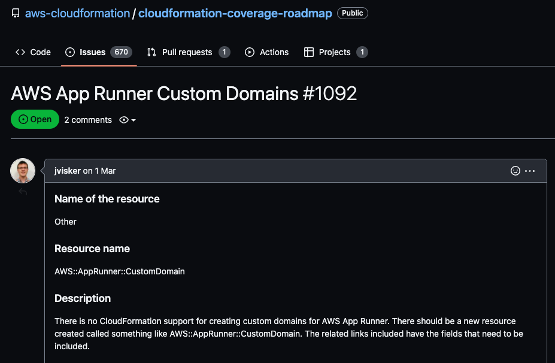
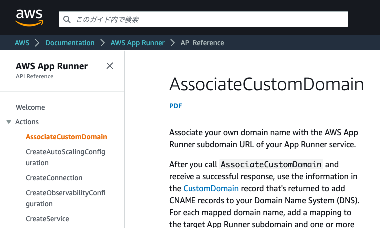
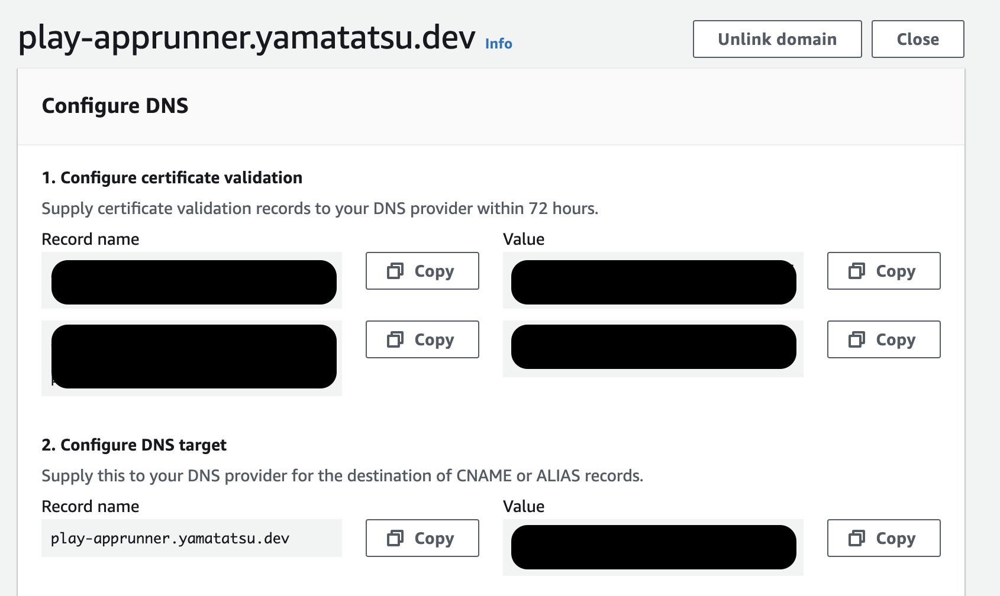

### 目次

- ~~CDK で App Runner してみる~~
- ~~RDS に繋いでみる~~
- **カスタムドメインを設定してみる**
- Tipsなど
---

## カスタムドメインを設定してみる
---
CloudFormationはサポートしていません  
 <!-- .element: height="500px" -->
Notes:
GitHub Issue  
https://github.com/aws-cloudformation/cloudformation-coverage-roadmap/issues/1092
---
でもAPIはサポートしていています
 <!-- .element: height="450px" -->
Notes:
API Reference
https://docs.aws.amazon.com/ja_jp/apprunner/latest/api/API_AssociateCustomDomain.html <!-- .element: style="overflow-wrap: break-word;" -->
---
## じゃあCustom Resourceだ
---
### Custom Resource とは
- CloudFormationが用意してくれている機能
- LambdaをCloudFormationのリソースとして呼び出せる
- CDKではSDKを呼び出すだけのCustom Resourceを簡単に作成できる
---
```ts [|7|81-104]
import { Construct } from "constructs";
import * as cdk from "aws-cdk-lib";
import * as ec2 from "aws-cdk-lib/aws-ec2";
import * as rds from "aws-cdk-lib/aws-rds";
import * as iam from "aws-cdk-lib/aws-iam";
import * as assets from "aws-cdk-lib/aws-ecr-assets";
import * as cr from "aws-cdk-lib/custom-resources";
import * as apprunner from "@aws-cdk/aws-apprunner-alpha";

export class PlaygroundCdkStack extends cdk.Stack {
  constructor(scope: Construct, id: string, props?: cdk.StackProps) {
    super(scope, id, props);

    const vpc = new ec2.Vpc(this, "Vpc", {
      natGatewayProvider: ec2.NatProvider.instance({
        instanceType: ec2.InstanceType.of(
          ec2.InstanceClass.T3,
          ec2.InstanceSize.NANO
        ),
      }),
      subnetConfiguration: [
        { name: "db-subnet",subnetType: ec2.SubnetType.PRIVATE_ISOLATED,cidrMask: 28 },
        { name: "app-subnet",subnetType: ec2.SubnetType.PRIVATE_WITH_NAT,cidrMask: 24 },
        { name: "public-subnet",subnetType: ec2.SubnetType.PUBLIC,cidrMask: 24 },
      ],
    });

    const database = new rds.DatabaseCluster(this, "Database", {
      engine: rds.DatabaseClusterEngine.auroraMysql({
        version: rds.AuroraMysqlEngineVersion.VER_2_10_2,
      }),
      instanceProps: {
        instanceType: ec2.InstanceType.of(
          ec2.InstanceClass.T3,
          ec2.InstanceSize.SMALL
        ),
        vpc,
        vpcSubnets: { subnetGroupName: "db-subnet" },
      },
      defaultDatabaseName: "mydb",
      credentials: rds.Credentials.fromGeneratedSecret("admin"),
      removalPolicy: cdk.RemovalPolicy.DESTROY,
    });

    const vpcConnector = new apprunner.VpcConnector(this, "VpcConnector", {
      vpc,
      vpcSubnets: { subnetGroupName: "app-subnet" },
    });
    database.connections.allowDefaultPortFrom(vpcConnector);

    const asset = new assets.DockerImageAsset(this, "ImageAssets", {
      directory: "./app",
      platform: assets.Platform.LINUX_AMD64,
    });

    const instanceRole = new iam.Role(this, "InstanceRole", {
      assumedBy: new iam.ServicePrincipal("tasks.apprunner.amazonaws.com"),
    });
    database.secret!.grantRead(instanceRole);

    const service = new apprunner.Service(this, "Service", {
      source: apprunner.Source.fromAsset({
        asset: asset,
        imageConfiguration: {
          port: 3000,
          environment: {
            DB_SECRET_NAME: database.secret!.secretName,
          },
        },
      }),
      vpcConnector,
      instanceRole: instanceRole,
    });

    const bastion = new ec2.BastionHostLinux(this, "Bastion", {
      vpc,
      subnetSelection: vpc.selectSubnets({ subnetGroupName: "app-subnet" }),
    });
    database.connections.allowDefaultPortFrom(bastion);

    new cr.AwsCustomResource(this, "CustomDomain", {
      onCreate: {
        service: "AppRunner",
        action: "associateCustomDomain",
        parameters: {
          DomainName: "play-apprunner.yamatatsu.dev",
          ServiceArn: service.serviceArn,
          EnableWWWSubdomain: false,
        },
        physicalResourceId: cr.PhysicalResourceId.of("AppRunnerCustomDomain"),
      },
      onDelete: {
        service: "AppRunner",
        action: "disassociateCustomDomain",
        parameters: {
          DomainName: "play-apprunner.yamatatsu.dev",
          ServiceArn: service.serviceArn,
        },
        physicalResourceId: cr.PhysicalResourceId.of("AppRunnerCustomDomain"),
      },
      policy: cr.AwsCustomResourcePolicy.fromSdkCalls({
        resources: [service.serviceArn],
      }),
    });
  }
}
```
Notes:
まずは aws-cdk-lib/custom-resources をimportして、

AwsCustomResource を作成します。
---
 <!-- .element: height="600px" -->
Notes:
CDKのデプロイが完了したら、ACM検証用とカスタムドメイン用のドメイン設定事項を確認し、DNSレコードを設定します。
---
```bash
# terminal にて

> curl https://play-apprunner.yamatatsu.dev/items
# {"items":[{"id":1,"name":"sample"}]}
```
Notes:
DNSレコードを設定してACMの検証が完了したら、カスタムドメインの設定は完了です。
---
### カスタムドメインが設定できました！ 🎉
