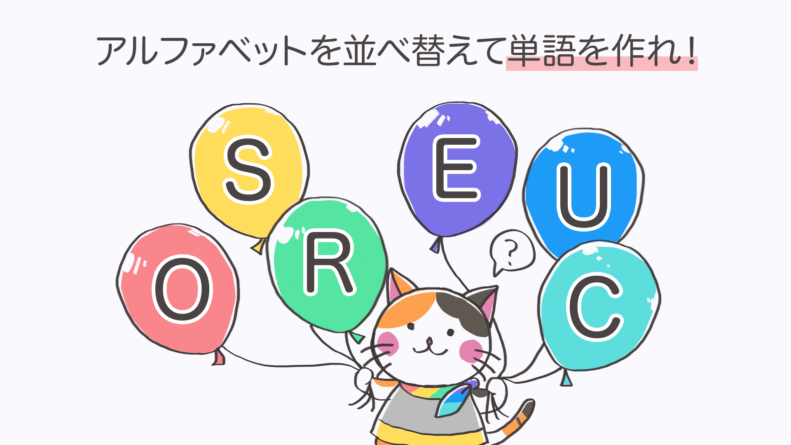

最後にCDKについて
- アプリケーションコードでAWS環境を定義する
- AWS環境だけでなく、そこで動かすアプリケーションも一緒くたに扱うことをコンセプトとしている
- アプリケーションとインフラの境界を曖昧にする
- 銀の弾丸ではありません
---
### ご清聴ありがとうございました！
---
最後にクイズです！
---
DevelopersIO 2022 イベントサイトの ○○○○○○ を見よう！○○○○○○ の部分は下の画像がヒントだよ！  
 <!-- .element: height="500px" -->
