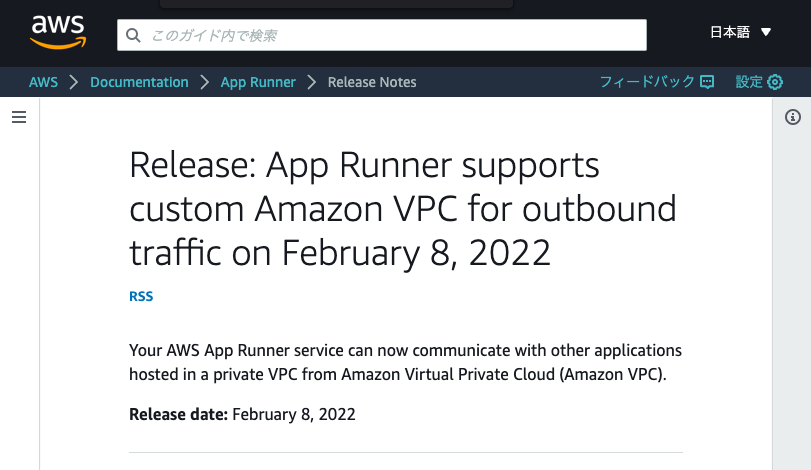
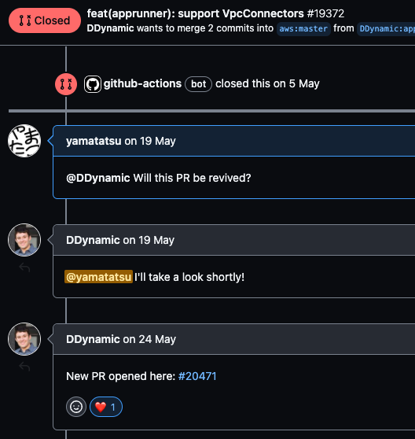

### 目次

- ~~cdk init してみる~~
- ~~App Runner してみる~~
- **VPC してみる**
- RDS してみる
- Bastion してみる
- route53 と ACM してみる
- Tipsなど
---
## VPC してみる
---
 <!-- .element height="500" -->
Note: 今年の2月に、App RunnerはVPCと繋ぐことができるようになりました
---
 <!-- .element height="600" -->
Note: CDKでも5月に、PRがマージされてL2として使うことができるようになりました。
---
```ts [|3,11-17|19-22,36]
import { Stack, StackProps } from "aws-cdk-lib";
import { Construct } from "constructs";
import * as ec2 from "aws-cdk-lib/aws-ec2";
import * as assets from "aws-cdk-lib/aws-ecr-assets";
import * as apprunner from "@aws-cdk/aws-apprunner-alpha";

export class PlaygroundCdkStack extends Stack {
  constructor(scope: Construct, id: string, props?: StackProps) {
    super(scope, id, props);

    const vpc = new ec2.Vpc(this, "Vpc", {
      natGateways: 0,
      subnetConfiguration: [
        { name: "app-subnet", subnetType: ec2.SubnetType.PRIVATE_ISOLATED },
        { name: "db-subnet", subnetType: ec2.SubnetType.PRIVATE_ISOLATED },
      ],
    });

    const vpcConnector = new apprunner.VpcConnector(this, "VpcConnector", {
      vpc,
      vpcSubnets: { subnetGroupName: "app-subnet" },
    });

    const asset = new assets.DockerImageAsset(this, "ImageAssets", {
      directory: "./app",
      platform: assets.Platform.LINUX_AMD64,
    });

    new apprunner.Service(this, "Service", {
      source: apprunner.Source.fromAsset({
        asset: asset,
        imageConfiguration: {
          port: 3000,
        },
      }),
      vpcConnector,
    });
  }
}
```
Note:
先程のファイルをこのように修正します。

VPCを作成します。今回は isolated subnet を2つ、アプリケーション用とDB用とで作成します。

VpcConnectorを使用することでVPCとApp Runnerを繋ぐことができます
---
### [VPC してみる] まとめ
- apprunner.VpcConnector!!
