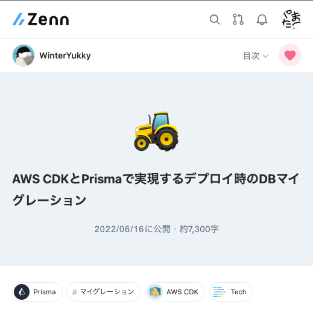

### 目次

- ~~cdk init してみる~~
- ~~App Runner してみる~~
- ~~VPC してみる~~
- ~~RDS してみる~~
- **Bastion してみる**
- route53 と ACM してみる
- 小ネタ `environment-agnostic` のメリデメ
---
```ts [|64-68]
import { Stack, StackProps } from "aws-cdk-lib";
import { Construct } from "constructs";
import * as ec2 from "aws-cdk-lib/aws-ec2";
import * as rds from "aws-cdk-lib/aws-rds";
import * as assets from "aws-cdk-lib/aws-ecr-assets";
import * as apprunner from "@aws-cdk/aws-apprunner-alpha";

export class PlaygroundCdkStack extends Stack {
  constructor(scope: Construct, id: string, props?: StackProps) {
    super(scope, id, props);

    const vpc = new ec2.Vpc(this, "Vpc", {
      natGateways: 0,
      subnetConfiguration: [
        { name: "app-subnet", subnetType: ec2.SubnetType.PRIVATE_ISOLATED },
        { name: "db-subnet", subnetType: ec2.SubnetType.PRIVATE_ISOLATED },
      ],
    });

    const database = new rds.DatabaseCluster(this, "Database", {
      engine: rds.DatabaseClusterEngine.auroraMysql({
        version: rds.AuroraMysqlEngineVersion.VER_2_10_2,
      }),
      instanceProps: {
        instanceType: ec2.InstanceType.of(
          ec2.InstanceClass.T3,
          ec2.InstanceSize.SMALL
        ),
        vpc,
        vpcSubnets: { subnetGroupName: "db-subnet" },
      },
      defaultDatabaseName: "mydb",
      credentials: rds.Credentials.fromGeneratedSecret("admin"),
    });

    const vpcConnector = new apprunner.VpcConnector(this, "VpcConnector", {
      vpc,
      vpcSubnets: { subnetGroupName: "app-subnet" },
    });
    database.connections.allowDefaultPortFrom(vpcConnector);

    const asset = new assets.DockerImageAsset(this, "ImageAssets", {
      directory: "./app",
      platform: assets.Platform.LINUX_AMD64,
    });

    new apprunner.Service(this, "Service", {
      source: apprunner.Source.fromAsset({
        asset: asset,
        imageConfiguration: {
          port: 3000,
          environment: {
            DB_USERNAME: database.secret!.secretValueFromJson("username").unsafeUnwrap(),
            DB_PASSWORD: database.secret!.secretValueFromJson("password").unsafeUnwrap(),
            DB_HOST: database.secret!.secretValueFromJson("host").unsafeUnwrap(),
            DB_PORT: database.secret!.secretValueFromJson("port").unsafeUnwrap(),
            DB_NAME: database.secret!.secretValueFromJson("dbname").unsafeUnwrap(),
          },
        },
      }),
      vpcConnector,
    });

    const bastion = new ec2.BastionHostLinux(this, "Bastion", {
      vpc,
      subnetSelection: vpc.selectSubnets({ subnetGroupName: "app-subnet" }),
    });
    database.connections.allowDefaultPortFrom(bastion);
  }
}
```
Notes:
先程のstackに、

ec2.BastionHostLinux を追加します。  

https://github.com/aws/aws-cdk/blob/main/packages/%40aws-cdk/aws-ec2/lib/bastion-host.ts#L110-L115
---
中に入ってDBをほげほげしてnodeから繋ぐ
---
[ <!-- .element height="600" -->](https://zenn.dev/winteryukky/articles/d766b9ab98eb23)
